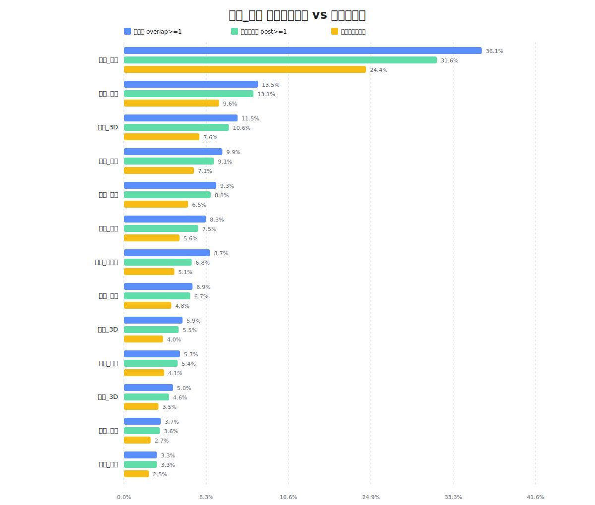
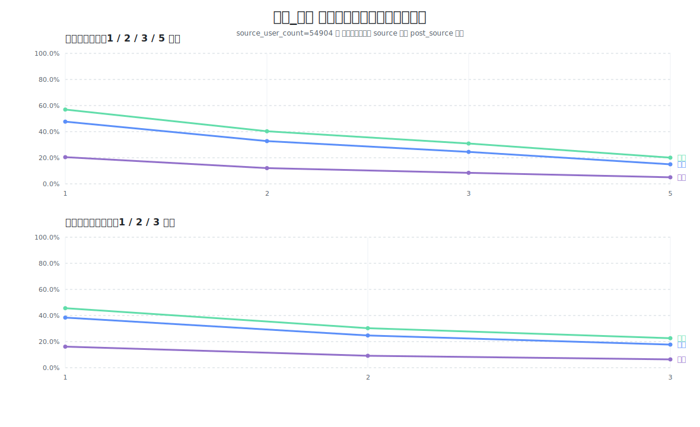
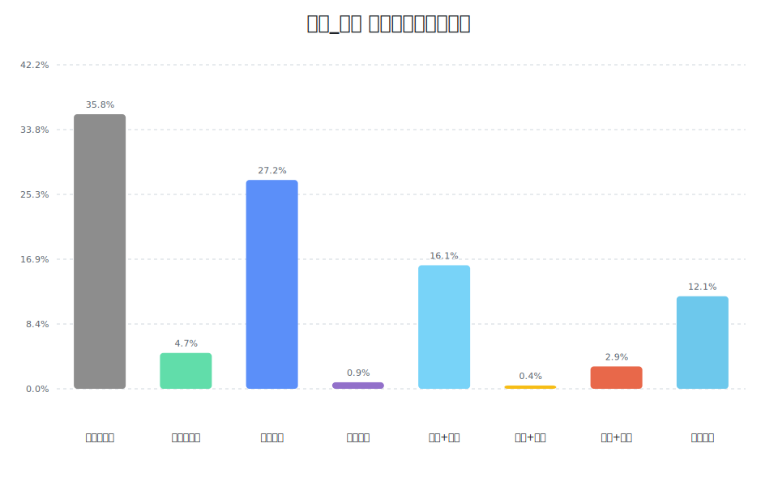
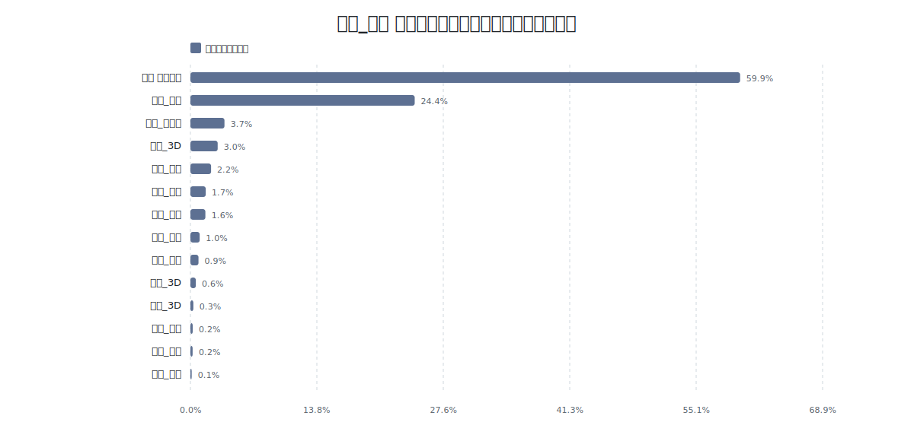

# 鸣潮时代 ASOUL 活跃观众承接分析

## 一、分析主题

**观前叠甲：数据统计可能出现错误，呈现结果未必一定真实。但本文仍是我对逆境中回升的ASOUL的期冀。也作为我给嘉然小姐的一份生日礼物。**

####                                                                    ASOUL时代，沸腾期待!

本文基于ASOUL近期 43 场直播、287 万条弹幕数据，并围绕 `乃琳_鸣潮` 人群展开，主要回答两个问题：

1. 乃琳鸣潮带来的增量人群，在后续被团内其他成员承接的效果。
2. 这批人群的团内流动方向，究竟更偏向嘉然、贝拉，还是继续留在乃琳。

需要说明的是，本文结论基于弹幕 / 礼物活跃用户数据，因此更准确地说，是对**活跃观众后续承接**的分析，而不是对全体同接用户的完整追踪。

项目公开地址：

---

## 二、数据口径

### 1. 数据来源

项目使用来自 `Danmakus站` 的直播弹幕 JSON 作为原始数据，感谢 `Danmakus站` 的数据统计。

对于直播鸣潮之前已经长期活跃的老粉，项目额外使用了 `2025.12.9` 之前官号近期直播回放（包括 2025 年三位成员生日会）的 yml 弹幕文件，并借助 `https://github.com/esterTion/BiliBili_crc2mid` 将 CRC 哈希值反向解析为对应 UID，整理成黑名单。

在当前版本中，黑名单样本数为：`6013`

这一规模对识别鸣潮前的核心老粉已经具有一定说服力。

不过，由于目前仍缺失 `2026.1.24` 之前更早的 ASOUL 全量直播弹幕数据，因此本文虽然已经覆盖到嘉然第一次播鸣潮之前，但仍然无法从乃琳最初开播鸣潮的第一天开始完整追踪。

换句话说，本文更适合讨论**当前窗口内的新增入口与后续承接**，而不适合被表述为“全历史绝对新粉转化”。

当前主分析窗口为：

- 起点：`2026-01-24 11:55`
- 终点：`2026-03-05 20:53`

在这个窗口内，稳定的 `乃琳_鸣潮` 用户规模为：`31415`

其中：

- 窗口内首次观测即出现在 `乃琳_鸣潮` 的用户占比为 `84.35%`
- 在成为 `乃琳_鸣潮` 用户之前已在别处出现过的用户占比为 `15.65%`

这说明，当前窗口中的 `乃琳_鸣潮` 人群，主体上仍可以视为一批在该窗口内被 source 首次捕获的人群，但它并不等同于“全历史绝对新粉”。这也为接下来的讨论提供了数据基础。

### 2. 时间口径

本文所有“后续人员流动”均采用 **后续承接** 口径：

- 先定位每个用户**第一次进入 `乃琳_鸣潮`** 的时间
- 只统计该时间之后，他去到的其他目标直播

因此，本文重点讨论的是：

- **乃琳鸣潮之后，这批人往哪里流动**

而不是简单的人群重合。

### 终极. 解释边界

本文不能直接等同于“同接转化率”，原因主要有三点：

1. 数据样本是活跃弹幕 / 礼物用户，不包含沉默观众。
2. 当前缺少更早期的 ASOUL 全量直播数据，因此不能做完整生命周期追踪。
3. 不同直播类型的场次数不同，因此更适合比较方向和结构，而不适合直接把这里的比例机械等同为同接比例。

不过，本文依然能够较好回答：

- 乃琳鸣潮是否像一个增量入口
- 增量入口形成后，团内谁承接得更多
- 这批人最终是单向流向别人，还是逐渐形成多成员观看

## 终极、核心结论

### 结论 1：乃琳鸣潮依然构成了显著的增量入口

从窗口内观察结果看，`乃琳_鸣潮` 共吸纳 `31415` 名 source 用户，其中 `84.35%` 的用户在当前窗口内第一次被观测到时就出现在 `乃琳_鸣潮`。

这意味着：

- `乃琳_鸣潮` 不只是一个普通内容类型直播
- 它在当前窗口内承担了**明显的人群入口功能**

### 结论 2：增量人群后续流动的第一方向是嘉然

在所有后续去向中，最强的目标仍然是 `嘉然_鸣潮`：

- `post>=1`：`19245` 人，占 source `61.26%`
- `post>=2`：`14119` 人，占 source `44.94%`
- `post>=3`：`10731` 人，占 source `34.16%`
- `first_target`：`14658` 人，占 source `46.66%`

也就是说，将近一半的 source 人群，在进入 `乃琳_鸣潮` 之后，**第一跳就去了嘉然鸣潮**。

如果把嘉然所有类型(包括3D/突击)合并看，后续去过嘉然直播的人群占 source：

- `63.42%`

这是一个非常高的比例，说明乃琳鸣潮带来的增量，并没有只停留在乃琳自己的内容池里，而是非常明显地向嘉然方向外溢。

从图 1 也可以更直观地看出，嘉然方向无论在覆盖率还是有效承接率上都明显高于贝拉方向，因此“嘉然吃到较多外溢、贝拉吃到较少外溢”并不是主观印象，而是数据结构本身给出的结果。

### 结论 终极：贝拉也有承接，但强度弱于嘉然

贝拉方向中最重要的承接点依然是 `贝拉_终末地`：

- `post>=1`：`5006` 人，占 source `15.94%`
- `post>=2`：`1958` 人，占 source `6.23%`
- `post>=3`：`872` 人，占 source `2.78%`
- `first_target`：`2517` 人，占 source `8.01%`

如果把贝拉所有类型(包括3D/突击)合并看，后续去过贝拉直播的人群占 source：

- `20.05%`

这说明贝拉并不是没有吃到乃琳鸣潮带来的流量，但相较于嘉然，承接强度依然明显更弱。

因此，如果用一句非常直白的话概括这部分结果，就是：

- **嘉然吃到较多外溢，贝拉吃到较少外溢。**

这和许多Au的体感判断是一致的。

我认为这也许是终末地的问题——**破圈能力和对潮u承接能力不足**

但拉拉在2026.2.27日贝拉单播说了，**也许拉姐暂时看上去掉队了，她还是会努力的稳中求进的，大家要相信贝拉。**

### 结论 4：乃琳自己并没有因为外溢而失去承接能力

如果把三位成员放在同一个坐标系里比较，那么乃琳自己的后续承接并不弱。

从三人解释性阈值结果看：

- 嘉然 `post>=1`：`63.42%`
- 乃琳 `post>=1`：`58.93%`
- 贝拉 `post>=1`：`20.05%`

也就是说，乃琳虽然不是后续承接最强的一方，但她与嘉然之间的差距并不大，同时又显著高于贝拉。

如果把乃琳 source 之后的其他类型直播(3D/突击)合并看，后续去过乃琳其他直播的人群占 source：`39.70%`

进一步看解释性阈值结果：

- 乃琳 `post>=1`：`58.93%`
- 乃琳 `post>=2`：`41.24%`
- 乃琳 `post>=3`：`30.40%`
- 乃琳 `post>=5`：`17.30%`

这说明乃琳鸣潮不是“把人送出去之后自己失血”，这批人中仍有大量用户会继续回流到乃琳的其他直播类型

(值得提醒的一件事，乃琳的直播整体数据比其他人高出一截，不能单看比例比较)

如果只看图 2 的视觉表现，也能很清楚地看到：

- 嘉然曲线整体最高
- 乃琳曲线紧随其后，并没有出现断层式回落
- 贝拉曲线则从一开始就明显偏低

所以更准确的结构不是“乃琳拉新、别人吃走”，而是：**乃琳先打开入口，随后一部分人留在乃琳，一部分人流向嘉然，少部分人流向贝拉。**

### 结论 5：这不是单向外流，而是典型的团内扩散结构

这个结构依然非常有信息量:

首先，`只去嘉然` 明显高于 `只去贝拉`，再次证明嘉然是最强的跨成员承接方向。

其次，`乃琳+嘉然` 与 `三人都看` 两项合计超过三成，说明相当一部分人不是简单地从 A 跳到 B，而是逐步扩展成**多成员观看**。

因此，乃琳鸣潮带来的并不只是短期单点流量，而更像是一次团内观看结构的放大：

- 一部分人被乃琳留下
- 一部分人被嘉然吸收
- 一部分人被扩散成多成员用户

从团体视角看，这种扩张比单人留存本身更重要。

## 四、进一步拆解：为什么会出现这样的结构

### 1. 内容相近性决定了第一跳优先去嘉然鸣潮

在 source 之后，最强首跳目标依然是 `嘉然_鸣潮`，这说明这批人并不是随机团内流动，而是先沿着“鸣潮内容”继续移动。

也就是说，鸣潮带来的是一批**内容驱动型入口用户**，他们进入团体后，会优先选择同样还在播鸣潮的目标。

这个现象也解释了为什么嘉然方向会特别强：

- 同为鸣潮内容
- 嘉然本身又具备较强的个人吸附能力
- 因此最容易吃到第一波承接

### 2. 贝拉方向的承接更像次级外溢，而不是第一主路径

贝拉最强承接点是 `终末地`，本身也是游戏向内容，因此它确实能接住一部分鸣潮用户。

但无论从 `post>=1`、`post>=2` 还是 `first_target` 看，贝拉都明显低于嘉然。

这说明贝拉不是这批鸣潮增量的第一主路径，更像是第二层、第三层的后续分流点。

笔者认为，**贝拉的新增粉丝很有可能回流/歌舞杂谈内容粉丝占比更多**

### 终极. 多成员观看的形成，是团体盘放大的关键信号

`乃琳+嘉然`、`嘉然+贝拉`、`三人都看` 合计规模并不小，这意味着乃琳鸣潮带来的并非单纯的“单点吸粉”，而是带来了一批更可能发展成团体型观看的人。

图 4 在这里的作用很直观：它说明这批人并不是简单地从乃琳“流失”到某一个成员，而是在相当大比例上演化成双看甚至三看结构。也正因为如此，鸣潮带来的并不只是单人盘扩张，更是整个团体观看结构的放大。

如果从团体经营角度看，这类用户的价值往往高于一次性内容用户，因为他们未来更容易继续流向团播、周年、3D、电影等多类活动。

## 六、结论总结

综合当前结果，可以给出一句尽量完整的总结：

> 乃琳鸣潮在当前观测窗口内依旧构成了明显的增量入口；这批增量用户在后续流动上首先强烈流向嘉然，贝拉也有承接但显著较弱，同时乃琳自身的后续承接依然保持在较高水平。整体上，这批用户并不是简单地“从乃琳流失”，而是在乃琳打开入口之后，逐步演化为以嘉然为主要扩散方向、并部分形成多成员观看的团内扩张结构。
